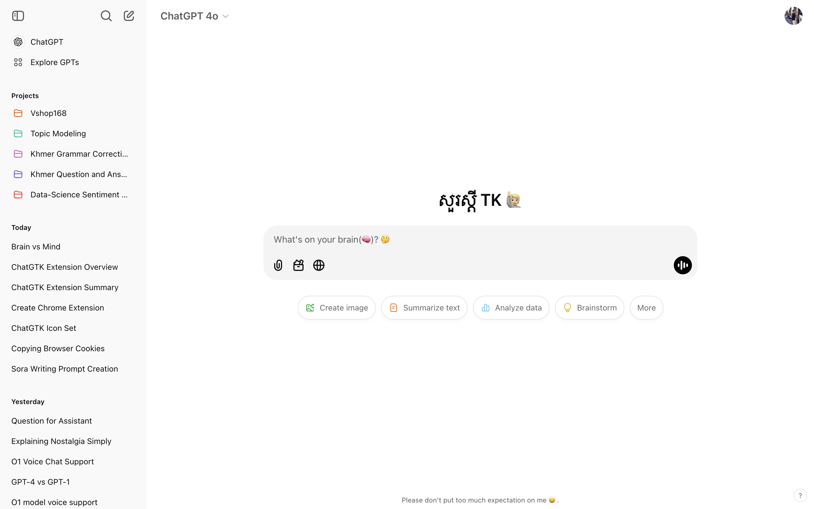
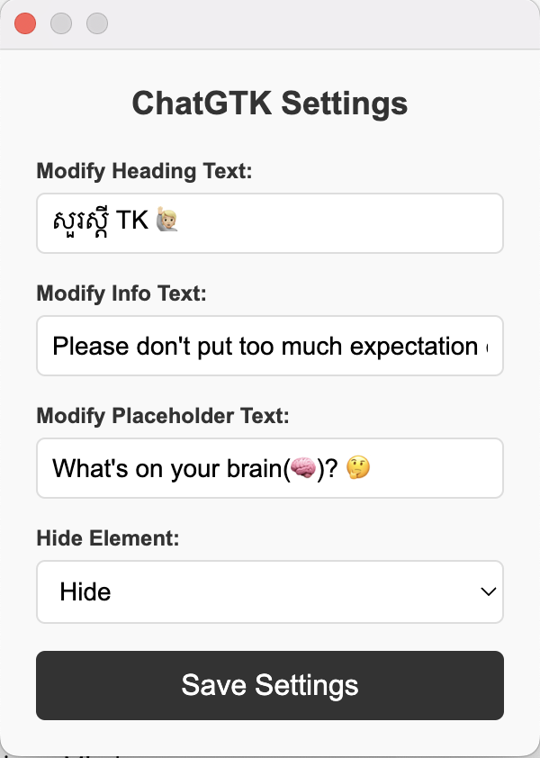
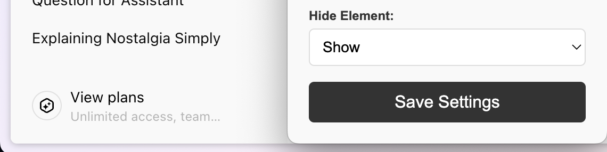
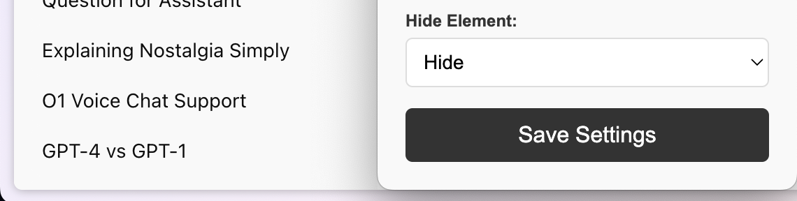
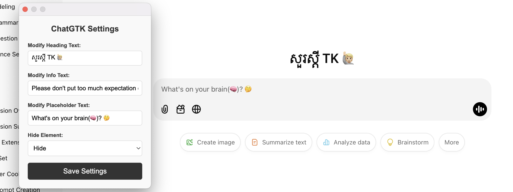

# README for ChatGTK Extension

---

## ChatGTK

**ChatGTK** is a Chrome extension designed to enhance your ChatGPT experience. Customize the ChatGPT interface with ease by modifying text, placeholders, and visibility of elements.

---

## Features

- Modify the heading, info, and placeholder text in the ChatGPT interface.
- Show or hide specific elements for a cleaner interface.
- Easy-to-use popup for real-time customization.
- Works exclusively on `chatgpt.com`.

---

## Installation (Developer Mode)

1. **Download the Extension:**
   - Clone or download this repository to your local machine.

2. **Unzip the Files (if necessary):**
   - Ensure the following files are included:

     ```json
     /ChatGTK
       ├── manifest.json
       ├── contentScript.js
       ├── popup.html
       ├── popup.js
       ├── styles.css
       ├── icons/
           ├── icon-16.png
           ├── icon-48.png
           ├── icon-128.png
     ```

3. **Enable Developer Mode in Chrome:**
   - Open Chrome and navigate to `chrome://extensions/`.
   - Toggle the **Developer Mode** switch in the top-right corner.

4. **Load the Extension:**
   - Click **"Load unpacked"**.
   - Select the cloned folder containing the extension files.

5. **Activate the Extension:**
   - Once loaded, the extension icon will appear in the Chrome toolbar.
   - Pin it for quick access.

---

## Usage Instructions

1. **Open ChatGPT:**
   - Navigate to `https://chatgpt.com`.

2. **Open ChatGTK Settings:**
   - Click on the ChatGTK icon in the Chrome toolbar to open the popup.

3. **Customize Settings:**
   - Modify the heading, info text, or placeholder text using the provided fields.
   - Choose to show or hide specific elements using the dropdown menu.

4. **Save Settings:**
   - Click **"Save Settings"** to apply changes instantly.

5. **See the Changes:**
   - The ChatGPT interface will update based on your customizations.

---

## Screenshots



### Popup Interface



### Customization in Action

- Toggle the visibility of elements

<p align="center">
  
  
</p>



---

## Troubleshooting

- **Extension Not Working?**
  - Ensure you are on `chatgpt.com`.
  - Check if the extension is enabled under `chrome://extensions/`.

- **Error: "Could not establish connection. Receiving end does not exist"**
  - Make sure you are on `chatgpt.com` as the extension only works on this domain.

- **Need Help?**
  - [Submit an issue](https://github.com/tykealy/chatgtk.git) or email us at `tykeaboyloy@gmail.com`.

---

## License

This project is licensed under the MIT License. See the `LICENSE` file for details.

---
